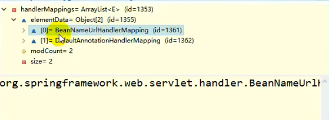

>前端控制器架构 dispatcherServlet详解
在原生的servlet中当控制器接收到前端请求时会通过doGet()或doPost()方法处理，那么在dispatcherServlet中是如何处理的呢？
首先可以确定的是dispatcherServlet 是属于HttpServlet的一个实现
继承关系如下：
class DispatcherServlet extends FrameworkServlet
class FrameworkServlet extends HttpServletBean
HttpServletBean extends HttpServlet
继承关系图如下图：

首先 一个请求过来先来到HttpServlet 的 doGet()或者doPost()中 发现HttpServlet中的servlet并未做仍和事情，
来到它的子类的实现发现HttpServletBean并没有重写该方法，而在FrameworkServlet中对该方法进行了重写

@Override
protected final void doGet(HttpServletRequest request, HttpServletResponse response)
throws ServletException, IOException {

		processRequest(request, response);
	}

	/**
	 * Delegate POST requests to {@link #processRequest}.
	 * @see #doService
	 */
	@Override
	protected final void doPost(HttpServletRequest request, HttpServletResponse response)
			throws ServletException, IOException {

		processRequest(request, response);
	}
发现无论是doGet()方法还是doPost()方法都调用了一个 processRequest(request, response);用于处理请求。
在processRequest(request, response)方法又通过一个 doService(request, response);方法，进入
doService(request, response);方法后发现该方法属于FrameworkServlet类的一个抽象方法，所以只能找他的具体实现类
这个类就是DispatcherServlet。在DispatcherServlet的doService()方法中发现，调用一个doDispatch(request, response);方法
这个方法就是前端控制器真正处理请求的方法

接下来debug研究一下DispatcherServlet的doDispatch(request, response);请求处理器的流程。

protected void doDispatch(HttpServletRequest request, HttpServletResponse response) throws Exception {
        HttpServletRequest processedRequest = request;
        HandlerExecutionChain mappedHandler = null;
        boolean multipartRequestParsed = false;
        //获取到一个异步处理器 用于处理异步请求
		WebAsyncManager asyncManager = WebAsyncUtils.getAsyncManager(request);

		try {
			ModelAndView mv = null;
			Exception dispatchException = null;

			try {
                //1.检查是否文件上传请求 如果是文件上传请求包装为multipartRequestParsed
				processedRequest = checkMultipart(request);
				multipartRequestParsed = (processedRequest != request);
                //2.根据当前请求地址决定使用那个类(controller)能来处理这个请求
				// Determine handler for the current request.
				mappedHandler = getHandler(processedRequest);
				if (mappedHandler == null) {
                    //没找到处理器能处理这个请求 就抛异常或者页面跳转提示。
					noHandlerFound(processedRequest, response);
					return;
				}
                //3.拿到能执行这个类的所有方法的适配器，适配器通过反射执行 注解方法的适配器AmnnotationMethodHandlerAdapther
				// Determine handler adapter for the current request.
				HandlerAdapter ha = getHandlerAdapter(mappedHandler.getHandler());
                //4.获取请求的方式
				// Process last-modified header, if supported by the handler.
				String method = request.getMethod();
				boolean isGet = "GET".equals(method);
				if (isGet || "HEAD".equals(method)) {
					long lastModified = ha.getLastModified(request, mappedHandler.getHandler());
					if (new ServletWebRequest(request, response).checkNotModified(lastModified) && isGet) {
						return;
					}
				}
                //mappedHandler目标处理器
				if (!mappedHandler.applyPreHandle(processedRequest, response)) {
					return;
				}

				// Actually invoke the handler. 5.执行处理器的方法 通过ha适配器执行目标方法 返回值作为视图名 保存在ModelAndView
                //目标方法无论怎么写，最终适配器执行完成以后都会将执行后的信息封装成ModelAndview
                //  processedRequest 请求信息 mappedHandler 目标处理器
				mv = ha.handle(processedRequest, response, mappedHandler.getHandler());
                //如果是异步方法直接返回
				if (asyncManager.isConcurrentHandlingStarted()) {
					return;
				}
                //如果方法的反回值为void 使用默认的视图名， 默认的视图名称是请求地址的视图名
				applyDefaultViewName(processedRequest, mv);
				mappedHandler.applyPostHandle(processedRequest, response, mv);
			}
			catch (Exception ex) {
				dispatchException = ex;
			}
			catch (Throwable err) {
				// As of 4.3, we're processing Errors thrown from handler methods as well,
				// making them available for @ExceptionHandler methods and other scenarios.
				dispatchException = new NestedServletException("Handler dispatch failed", err);
			}
            //6.转发到目标页面 processedRequest：包装后的request  response请求的响应 mappedHandler 目标处理器 mv(地址加数据) ModelAndView返回给页面视图，ModelAndView中的数据从请求域中获取。
			processDispatchResult(processedRequest, response, mappedHandler, mv, dispatchException);
		}
		catch (Exception ex) {
			triggerAfterCompletion(processedRequest, response, mappedHandler, ex);
		}
		catch (Throwable err) {
			triggerAfterCompletion(processedRequest, response, mappedHandler,
					new NestedServletException("Handler processing failed", err));
		}
		finally {
			if (asyncManager.isConcurrentHandlingStarted()) {
				// Instead of postHandle and afterCompletion
				if (mappedHandler != null) {
					mappedHandler.applyAfterConcurrentHandlingStarted(processedRequest, response);
				}
			}
			else {
				// Clean up any resources used by a multipart request.
				if (multipartRequestParsed) {
					cleanupMultipart(processedRequest);
				}
			}
		}
	}
总结：
1.所有请求过来DispatcherServlet收到请求，
2.调用doDispatch()方法进行处理
  2.1 getHandler()根据当前请求地址决定使用那个类能来处理这个请求
       根据当前请求在HandlerMapping中找到这个请求的映射信息，获取取到目标处理器类
  2.2 getHandlerAdapter() 拿到能执行这个类的所有方法的适配器，适配器通过反射执行 注解方法的适配器
       根据当前处理器类，找到当前类的HandlerAdapter(适配器)
  2.3 使用刚才获取到的适配器（AnnotationMethodHandlerAdapter）执行目标方法;
  2.4 目标方法执行后会返回一个ModelAndView对象
  2.5 根据ModelAndView的信息转发到具体的页面，并可以在请求域中取出ModelAndView中的模型数据

2.1细节:如何根据当前请求地址决定使用那个类能来处理这个请求？
   2.1.1 mappedHandler = getHandler(processedRequest); mappedHandler是一个执行链，processedRequest保存着请求的地址

根据当前请求地址决定使用那个处理器类能来处理这个请求
@Nullable
protected HandlerExecutionChain getHandler(HttpServletRequest request) throws Exception {
    if (this.handlerMappings != null) {
        //handlerMappings处理器映射，保存了每一个处理器能处理那些方法的映射信息，在handlerMappings的handlerMap中保存着。handlerMappings的映射信息是IOC启动时维护好的(IOC启动创建Controller控制器对象的时候，会保存在handlerMappings的handlerMap属性中)。
        // 这里共两个类型的handlerMappings分别为BeanNameUrlHandlerMapping(主要使用于Spring4 将Bean的name作为请求的URL) DefaultUrlHandlerMapping
        for (HandlerMapping mapping : this.handlerMappings) {
            HandlerExecutionChain handler = mapping.getHandler(request);
            if (handler != null) {
                //拿到控制器链后就返回
                return handler;
            }
        }
    }
    return null;
}

handlerMappings两种 BeanNameUrlHandlerMapping(XML) 和 DefaultAnnotationHandlerMapping(注解)

其中 DefaultAnnotationHandlerMapping的handlerMap中就保存着方法URL和控制器类的映射信息
例如 /hello = com.itheima.controller.AttributeMappingController

handlerMap ioc容器启动创建Controller对象的时候扫描每个处理器都能处理什么请求，保存在HandlerMapping的handlerMap属性中;
下一次请求过来，就来看哪个HandlerMapping中有这个请求映射信息就行了;

2.2细节 如何获取适配器执行目标方法？
HandlerAdapter ha = getHandlerAdapter(mappedHandler.getHandler());  mappedHandler.getHandler()获取到的就是目标处理器类

protected HandlerAdapter getHandlerAdapter(Object handler) throws ServletException {
    if (this.handlerAdapters != null) {
        for (HandlerAdapter adapter : this.handlerAdapters) {
            if (adapter.supports(handler)) {
                return adapter;
        }
        }
    }
        throw new ServletException("No adapter for handler [" + handler +
    "]: The DispatcherServlet configuration needs to include a HandlerAdapter that supports this handler");
}
Adapter：可以理解为反射工具
handlerAdapters有三种，HttpRequestHandlerAdapter SimpleControllerHandlerAdapter AnnotationMethodHandlerAdapter(处理器是注解方法的反射工具)
前两种都是通过实现接口实现的 ，我们这里使用的是注解 处理器类中只要有标了注解的这些方法就能用;

三个适配器详解：
HttpRequestHandlerAdapter支持以前实现HttpRequestHandler
控制器的实现方式必须是继承自HttpRequestHandler
public boolean supports(Object handler) {
    return handler instanceof HttpRequestHandler;
}
SimpleControllerHandlerAdapter 控制器的实现必须是实现Controller的方式
public boolean supports(Object handler) {
    return handler instanceof Controller;
}
AnnotationMethodHandlerAdapter；通过注解的方式 @Controller的方式
public boolean supports(Object handler) {
    return handler instanceof Servlet;
}

这里使用注解的那个AnnotationAdapterHandler 

探究HandlerMapping 和HandlerAdapter是何时有值的呢？

org.springframework.web.servlet.DispatcherServlet中:

SpringMVC的九大组件:
  DispatcherServlet中有几个引用类型的属性;SpringMVC的九大组件;springMVC在工作的时候，关键位置都是由这些组件完成的;
共同点:九大组件全部都是接口; 接口就提供了扩展性和规范。
    
    //文件上传解析器
    @Nullable
    private MultipartResolver multipartResolver;
    //区域信息解析器和国际化有关
	/** LocaleResolver used by this servlet. */
	@Nullable
	private LocaleResolver localeResolver;
    //主题解析器，IDEA的主题切换
	/** ThemeResolver used by this servlet. */
	@Nullable
	private ThemeResolver themeResolver;
    
	/** List of HandlerMappings used by this servlet. */
	@Nullable
	private List<HandlerMapping> handlerMappings;
    //handler的适配器
	/** List of HandlerAdapters used by this servlet. */
	@Nullable
	private List<HandlerAdapter> handlerAdapters;
    //处理器异常解析器 SpringMVC强大的异常处理器
	/** List of HandlerExceptionResolvers used by this servlet. */
	@Nullable
	private List<HandlerExceptionResolver> handlerExceptionResolvers;
    // 
	/** RequestToViewNameTranslator used by this servlet. */
	@Nullable
	private RequestToViewNameTranslator viewNameTranslator;
    //SpringMVC允许重定向携带数据的功能 使用session模拟 一次转发后清一次session
	/** FlashMapManager used by this servlet. */
	@Nullable
	private FlashMapManager flashMapManager;
    //视图解析器
	/** List of ViewResolvers used by this servlet. */
	@Nullable
	private List<ViewResolver> viewResolvers;
    
这九大组件的是在何时初始化的呢？
在org.springframework.web.servlet.DispatcherServlet中:

    //spring源码中有这个方法onRefresh(),九大组件的初始化是在SpringIOC启动的时候

    @Override
    protected void onRefresh(ApplicationContext context) {
    initStrategies(context);
    }

	/**
	 * Initialize the strategy objects that this servlet uses.
	 * 
May be overridden in subclasses in order to initialize further strategy objects.
	 */
    //初始化九大组件 服务器一启动就为九大组件作初始化
	protected void initStrategies(ApplicationContext context) {
		initMultipartResolver(context);
		initLocaleResolver(context);
		initThemeResolver(context);
		initHandlerMappings(context);
		initHandlerAdapters(context);
		initHandlerExceptionResolvers(context);
		initRequestToViewNameTranslator(context);
		initViewResolvers(context);
		initFlashMapManager(context);
	}

这里主要研究:
    initHandlerMappings(context);
    initHandlerAdapters(context);

发现 public interface HandlerMapping 是一个接口包含众多的实现类：

初始化handlerMapping

    private void initHandlerMappings(ApplicationContext context) {
    this.handlerMappings = null;
        //如果要探查
		if (this.detectAllHandlerMappings) {
			// Find all HandlerMappings in the ApplicationContext, including ancestor contexts.
            //从bean工厂中找出所有的HandlerMapping,
			Map<String, HandlerMapping> matchingBeans =
					BeanFactoryUtils.beansOfTypeIncludingAncestors(context, HandlerMapping.class, true, false);
			if (!matchingBeans.isEmpty()) {
				this.handlerMappings = new ArrayList<>(matchingBeans.values());
				// We keep HandlerMappings in sorted order.
				AnnotationAwareOrderComparator.sort(this.handlerMappings);
			}
		}
		else {
			try {
                //从IOC容器中根据ID找handlerMapping
				HandlerMapping hm = context.getBean(HANDLER_MAPPING_BEAN_NAME, HandlerMapping.class);
				this.handlerMappings = Collections.singletonList(hm);
			}
			catch (NoSuchBeanDefinitionException ex) {
				// Ignore, we'll add a default HandlerMapping later.
			}
		}
        //如果没有找到就使用默认策略
		// Ensure we have at least one HandlerMapping, by registering
		// a default HandlerMapping if no other mappings are found.
		if (this.handlerMappings == null) {
			this.handlerMappings = getDefaultStrategies(context, HandlerMapping.class);
			if (logger.isTraceEnabled()) {
				logger.trace("No HandlerMappings declared for servlet '" + getServletName() +
						"': using default strategies from DispatcherServlet.properties");
			}
		}
	}
    
默认策略的一个加载过程：

    protected <T> List<T> getDefaultStrategies(ApplicationContext context, Class<T> strategyInterface) {
		String key = strategyInterface.getName(); 
        // 通过策略接口名获取到一个key 通过key获取一个value,通过value类型找到相应的类
		String value = defaultStrategies.getProperty(key);
		if (value != null) {
			String[] classNames = StringUtils.commaDelimitedListToStringArray(value);
			List<T> strategies = new ArrayList<>(classNames.length);
			for (String className : classNames) {
				try {
					Class<?> clazz = ClassUtils.forName(className, DispatcherServlet.class.getClassLoader());
					Object strategy = createDefaultStrategy(context, clazz);
					strategies.add((T) strategy);
				}
				catch (ClassNotFoundException ex) {
					throw new BeanInitializationException(
							"Could not find DispatcherServlet's default strategy class [" + className +
							"] for interface [" + key + "]", ex);
				}
				catch (LinkageError err) {
					throw new BeanInitializationException(
							"Unresolvable class definition for DispatcherServlet's default strategy class [" +
							className + "] for interface [" + key + "]", err);
				}
			}
			return strategies;
		}
		else {
			return new LinkedList<>();
		}
	}

   String value = defaultStrategies.getProperty(key);详解

    static {
		// Load default strategy implementations from properties file.
		// This is currently strictly internal and not meant to be customized
		// by application developers.
        // DEFAULT_STRATEGIES_PATH变量的值为 类路径下的 DispatcherServlet.properties
		try {
			ClassPathResource resource = new ClassPathResource(DEFAULT_STRATEGIES_PATH, DispatcherServlet.class);
			defaultStrategies = PropertiesLoaderUtils.loadProperties(resource);
		}
		catch (IOException ex) {
			throw new IllegalStateException("Could not load '" + DEFAULT_STRATEGIES_PATH + "': " + ex.getMessage());
		}
	}

默认配置文件的位置
defaultStrategies默认的位置是和DispatcherServlet同级的目录下 具体为：org.springframework.web.servlet.DispatcherServlet.properties文件加载为默认策略。
    
    private static final Properties defaultStrategies;
	static {
		// Load default strategy implementations from properties file.
		// This is currently strictly internal and not meant to be customized
		// by application developers.
		try {
			ClassPathResource resource = new ClassPathResource(DEFAULT_STRATEGIES_PATH, DispatcherServlet.class);
			defaultStrategies = PropertiesLoaderUtils.loadProperties(resource);
		}
		catch (IOException ex) {
			throw new IllegalStateException("Could not load '" + DEFAULT_STRATEGIES_PATH + "': " + ex.getMessage());
		}
	}

总结: 组件的初始化:去容器中找这个组件，如果没有找到就用默认的配置; 有些组件根据Id找，有些组件根据类型

执行目标方法细节，利用得到的适配器ha执行目标方法，并返回ModelAndView
通过反射执行，难点在于如何确定控制器方法的参数 mappedHandler目标处理器 processedRequest封装的请求
mv = ha.handle(processedRequest, response, mappedHandler.getHandler());

在org.springframework.web.servlet.mvc.method.AbstractHandlerMethodAdapter中
    
    @Override
    @Nullable
    public final ModelAndView handle(HttpServletRequest request, HttpServletResponse response, Object handler)
    throws Exception {

		return handleInternal(request, response, (HandlerMethod) handler);
	}
    @Nullable
    protected abstract ModelAndView handleInternal(HttpServletRequest request,
             HttpServletResponse response, HandlerMethod handlerMethod) throws Exception;

将处理器Handler转化成处理器方法HandlerMethod调用handleInternal方法

    @Override
    protected ModelAndView handleInternal(HttpServletRequest request,
    HttpServletResponse response, HandlerMethod handlerMethod) throws Exception {

		ModelAndView mav;
		checkRequest(request);

		// Execute invokeHandlerMethod in synchronized block if required.
        //异步Session 使用锁处理
		if (this.synchronizeOnSession) {
			HttpSession session = request.getSession(false);
			if (session != null) {
				Object mutex = WebUtils.getSessionMutex(session);
				synchronized (mutex) {
                    //执行处理器方法返回ModelAndView
					mav = invokeHandlerMethod(request, response, handlerMethod);
				}
			}
			else {
				// No HttpSession available -> no mutex necessary
				mav = invokeHandlerMethod(request, response, handlerMethod);
			}
		}
		else {
			// No synchronization on session demanded at all...
			mav = invokeHandlerMethod(request, response, handlerMethod);
		}

		if (!response.containsHeader(HEADER_CACHE_CONTROL)) {
			if (getSessionAttributesHandler(handlerMethod).hasSessionAttributes()) {
				applyCacheSeconds(response, this.cacheSecondsForSessionAttributeHandlers);
			}
			else {
				prepareResponse(response);
			}
		}

		return mav;
	} 

执行处理器方法返回ModelAndView
ModelAndView mav = invokeHandlerMethod(request, response, handlerMethod);

进入invokeHandlerMethod()
在org.springframework.web.servlet.mvc.method.annotation.RequestMappingHandlerAdapter

    @Nullable
    protected ModelAndView invokeHandlerMethod(HttpServletRequest request,
    HttpServletResponse response, HandlerMethod handlerMethod) throws Exception {

		ServletWebRequest webRequest = new ServletWebRequest(request, response);
		try {
			WebDataBinderFactory binderFactory = getDataBinderFactory(handlerMethod);
			ModelFactory modelFactory = getModelFactory(handlerMethod, binderFactory);

			ServletInvocableHandlerMethod invocableMethod = createInvocableHandlerMethod(handlerMethod);
			if (this.argumentResolvers != null) {
				invocableMethod.setHandlerMethodArgumentResolvers(this.argumentResolvers);
			}
			if (this.returnValueHandlers != null) {
				invocableMethod.setHandlerMethodReturnValueHandlers(this.returnValueHandlers);
			}
			invocableMethod.setDataBinderFactory(binderFactory);
			invocableMethod.setParameterNameDiscoverer(this.parameterNameDiscoverer);

			ModelAndViewContainer mavContainer = new ModelAndViewContainer();
			mavContainer.addAllAttributes(RequestContextUtils.getInputFlashMap(request));
			modelFactory.initModel(webRequest, mavContainer, invocableMethod);
			mavContainer.setIgnoreDefaultModelOnRedirect(this.ignoreDefaultModelOnRedirect);

			AsyncWebRequest asyncWebRequest = WebAsyncUtils.createAsyncWebRequest(request, response);
			asyncWebRequest.setTimeout(this.asyncRequestTimeout);

			WebAsyncManager asyncManager = WebAsyncUtils.getAsyncManager(request);
			asyncManager.setTaskExecutor(this.taskExecutor);
			asyncManager.setAsyncWebRequest(asyncWebRequest);
			asyncManager.registerCallableInterceptors(this.callableInterceptors);
			asyncManager.registerDeferredResultInterceptors(this.deferredResultInterceptors);

			if (asyncManager.hasConcurrentResult()) {
				Object result = asyncManager.getConcurrentResult();
				mavContainer = (ModelAndViewContainer) asyncManager.getConcurrentResultContext()[0];
				asyncManager.clearConcurrentResult();
				LogFormatUtils.traceDebug(logger, traceOn -> {
					String formatted = LogFormatUtils.formatValue(result, !traceOn);
					return "Resume with async result [" + formatted + "]";
				});
				invocableMethod = invocableMethod.wrapConcurrentResult(result);
			}
            //执行目标方法
			invocableMethod.invokeAndHandle(webRequest, mavContainer);
			if (asyncManager.isConcurrentHandlingStarted()) {
				return null;
			}

			return getModelAndView(mavContainer, modelFactory, webRequest);
		}
		finally {
			webRequest.requestCompleted();
		}
	}

invokeHandlerMethod中执行invocableMethod.invokeAndHandle(webRequest, mavContainer);方法set一些值
进入方法invokeAndHandle()方法此时来到：
org.springframework.web.servlet.mvc.method.annotation.ServletInvocableHandlerMethod

    public void invokeAndHandle(ServletWebRequest webRequest, ModelAndViewContainer mavContainer,
    Object... providedArgs) throws Exception {
        //确定参数信息
		Object returnValue = invokeForRequest(webRequest, mavContainer, providedArgs);
		setResponseStatus(webRequest);

		if (returnValue == null) {
			if (isRequestNotModified(webRequest) || getResponseStatus() != null || mavContainer.isRequestHandled()) {
				disableContentCachingIfNecessary(webRequest);
				mavContainer.setRequestHandled(true);
				return;
			}
		}
		else if (StringUtils.hasText(getResponseStatusReason())) {
			mavContainer.setRequestHandled(true);
			return;
		}

		mavContainer.setRequestHandled(false);
		Assert.state(this.returnValueHandlers != null, "No return value handlers");
		try {
			this.returnValueHandlers.handleReturnValue(
					returnValue, getReturnValueType(returnValue), mavContainer, webRequest);
		}
		catch (Exception ex) {
			if (logger.isTraceEnabled()) {
				logger.trace(formatErrorForReturnValue(returnValue), ex);
			}
			throw ex;
		}
	}
Object returnValue = invokeForRequest(webRequest, mavContainer, providedArgs);反射获得方法参数
进入invokeForRequest()方法
来到org.springframework.web.method.support.InvocableHandlerMethod

    @Nullable
    public Object invokeForRequest(NativeWebRequest request, @Nullable ModelAndViewContainer mavContainer, Object... providedArgs) throws Exception {
        //确定参数
        Object[] args = this.getMethodArgumentValues(request, mavContainer, providedArgs);
        if (this.logger.isTraceEnabled()) {
        this.logger.trace("Arguments: " + Arrays.toString(args));
    }

        return this.doInvoke(args);
    }

Object[] args = getMethodArgumentValues(request, mavContainer, providedArgs);

进入getMethodArgumentValues()
此时来到:org.springframework.web.method.support.InvocableHandlerMethod

    protected Object[] getMethodArgumentValues(NativeWebRequest request, @Nullable ModelAndViewContainer mavContainer, Object... providedArgs) throws Exception {
            MethodParameter[] parameters = this.getMethodParameters();
            if (ObjectUtils.isEmpty(parameters)) {
                return EMPTY_ARGS;
            } else {
                Object[] args = new Object[parameters.length];

            for(int i = 0; i < parameters.length; ++i) {
                MethodParameter parameter = parameters[i];
                parameter.initParameterNameDiscovery(this.parameterNameDiscoverer);
                args[i] = findProvidedArgument(parameter, providedArgs);
                if (args[i] == null) {
                    if (!this.resolvers.supportsParameter(parameter)) {
                        throw new IllegalStateException(formatArgumentError(parameter, "No suitable resolver"));
                    }

                    try {
                        args[i] = this.resolvers.resolveArgument(parameter, mavContainer, request, this.dataBinderFactory);
                    } catch (Exception var10) {
                        if (this.logger.isDebugEnabled()) {
                            String exMsg = var10.getMessage();
                            if (exMsg != null && !exMsg.contains(parameter.getExecutable().toGenericString())) {
                                this.logger.debug(formatArgumentError(parameter, exMsg));
                            }
                        }

                        throw var10;
                    }
                }
            }

            return args;
        }
    }

 以上的源码分析都是Spring4的源码和Spring5的源码相同
下面解析的过程看的是Spring4的源码解析，和Spring5的源码大不一样

    
