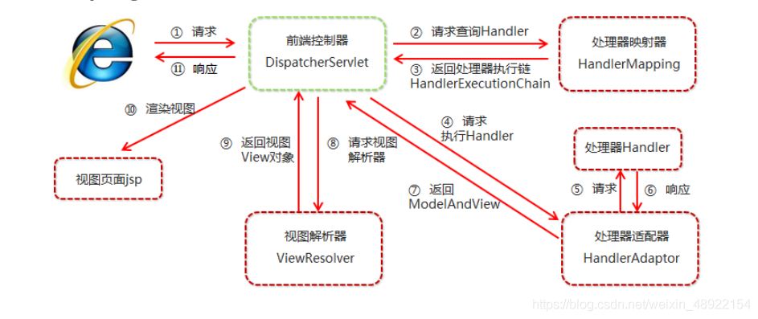
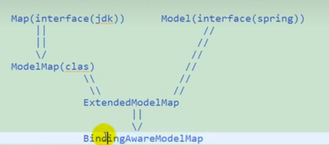
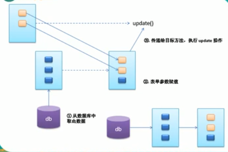

SpringMVC的执行流程:

使用PUT或者DELETE请求时可能出现以下问题 高版本Tomcat导致

解决办法就是增加一个配置 在JSP页面头文件增加 isErrorPage="true"
<%@ page contentType="text/html;charset=UTF-8" language="java" pageEncoding="UTF-8" isErrorPage="true" %>

@ModelAttribute原理
