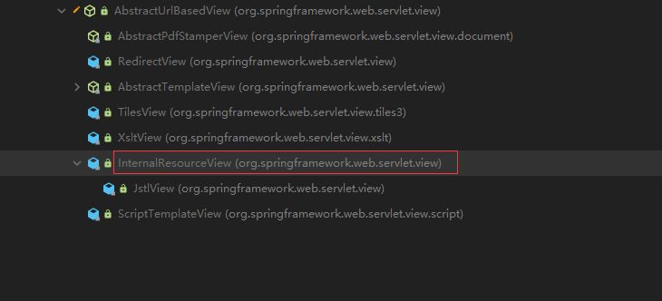

视图解析原理：
1、方法执行后的返回值会作为页面地址参考，转发或者重定向到页面
2、视图解析器可能会进行页面地址的拼串﹔

1、任何方法的返回值，最终都会被包装成ModelAndView对象
org.springframework.web.servlet.DispatcherServlet下：1040行返回视图方法

processDispatchResult(processedRequest, response, mappedHandler, mv, dispatchException);

    private void processDispatchResult(HttpServletRequest request, HttpServletResponse response,
    @Nullable HandlerExecutionChain mappedHandler, @Nullable ModelAndView mv,
    @Nullable Exception exception) throws Exception {
        
		boolean errorView = false;

		if (exception != null) {
			if (exception instanceof ModelAndViewDefiningException) {
				logger.debug("ModelAndViewDefiningException encountered", exception);
				mv = ((ModelAndViewDefiningException) exception).getModelAndView();
			}
			else {
				Object handler = (mappedHandler != null ? mappedHandler.getHandler() : null);
				mv = processHandlerException(request, response, handler, exception);
				errorView = (mv != null);
			}
		}

		// Did the handler return a view to render?
		if (mv != null && !mv.wasCleared()) {
            //该方法就是渲染页面 mv包含地址和数据
			render(mv, request, response);
			if (errorView) {
				WebUtils.clearErrorRequestAttributes(request);
			}
		}
		else {
			if (logger.isTraceEnabled()) {
				logger.trace("No view rendering, null ModelAndView returned.");
			}
		}

		if (WebAsyncUtils.getAsyncManager(request).isConcurrentHandlingStarted()) {
			// Concurrent handling started during a forward
			return;
		}

		if (mappedHandler != null) {
			// Exception (if any) is already handled..
			mappedHandler.triggerAfterCompletion(request, response, null);
		}
	}
视图渲染流程:将域中的数据在页面展示;
4、View与ViewResolver; ViewResolver的作用是根据视图名（方法的返回值）得到View对象;

    protected void render(ModelAndView mv, HttpServletRequest request, HttpServletResponse response) throws Exception {
    // Determine locale for request and apply it to the response.
    Locale locale =
    (this.localeResolver != null ? this.localeResolver.resolveLocale(request) : request.getLocale());
    response.setLocale(locale);

		View view;
		String viewName = mv.getViewName();
		if (viewName != null) {
            //根据方法的返回值(viewName 视图名)得到view对象  mv.getModelInternal()隐含模型中的数据
			// We need to resolve the view name.
			view = resolveViewName(viewName, mv.getModelInternal(), locale, request);
			if (view == null) {
				throw new ServletException("Could not resolve view with name '" + mv.getViewName() +
						"' in servlet with name '" + getServletName() + "'");
			}
		}
		else {
			// No need to lookup: the ModelAndView object contains the actual View object.
			view = mv.getView();
			if (view == null) {
				throw new ServletException("ModelAndView [" + mv + "] neither contains a view name nor a " +
						"View object in servlet with name '" + getServletName() + "'");
			}
		}

		// Delegate to the View object for rendering.
		if (logger.isTraceEnabled()) {
			logger.trace("Rendering view [" + view + "] ");
		}
		try {
			if (mv.getStatus() != null) {
				response.setStatus(mv.getStatus().value());
			}
            //得到view后调用render方法
			view.render(mv.getModelInternal(), request, response);
		}
		catch (Exception ex) {
			if (logger.isDebugEnabled()) {
				logger.debug("Error rendering view [" + view + "]", ex);
			}
			throw ex;
		}
	}
    render()方法的实现。
    @Override
	public void render(@Nullable Map<String, ?> model, HttpServletRequest request,
			HttpServletResponse response) throws Exception {

		if (logger.isDebugEnabled()) {
			logger.debug("View " + formatViewName() +
					", model " + (model != null ? model : Collections.emptyMap()) +
					(this.staticAttributes.isEmpty() ? "" : ", static attributes " + this.staticAttributes));
		}
        
		Map<String, Object> mergedModel = createMergedOutputModel(model, request, response);
        //准备响应
		prepareResponse(request, response);
        //渲染要给页面输出的数据
		renderMergedOutputModel(mergedModel, getRequestToExpose(request), response);
	}

    进入renderMergedOutputModel(mergedModel, getRequestToExpose(request), response);
    在org.springframework.web.servlet.view.InternalResourceView中

    protected void renderMergedOutputModel(Map<String, Object> model, HttpServletRequest request, HttpServletResponse response) throws Exception {
        //暴漏模型中的数据到请求域中
        this.exposeModelAsRequestAttributes(model, request);
        this.exposeHelpers(request);
        //拿到要转发去的路径
        String dispatcherPath = this.prepareForRendering(request, response);
        //转发器
        RequestDispatcher rd = this.getRequestDispatcher(request, dispatcherPath);
        if (rd == null) {
            throw new ServletException("Could not get RequestDispatcher for [" + this.getUrl() + "]: Check that the corresponding file exists within your web application archive!");
        } else {
            if (this.useInclude(request, response)) {
                response.setContentType(this.getContentType());
                if (this.logger.isDebugEnabled()) {
                    this.logger.debug("Including [" + this.getUrl() + "]");
                }

                rd.include(request, response);
            } else {
                if (this.logger.isDebugEnabled()) {
                    this.logger.debug("Forwarding to [" + this.getUrl() + "]");
                }
                //转发
                rd.forward(request, response);
            }

        }
    }
    进入exposeModelAsRequestAttributes(model, request);
    org.springframework.web.servlet.view.AbstractView中

    protected void exposeModelAsRequestAttributes(Map<String, Object> model,
			HttpServletRequest request) throws Exception {
        //遍历模型中的数据，放到request请求域中
		model.forEach((name, value) -> {
			if (value != null) {
				request.setAttribute(name, value);
			}
			else {
				request.removeAttribute(name);
			}
		});
	}

5、怎么能根据方法的返回值(视图名)得到View对象?
org.springframework.web.servlet.DispatcherServlet下:

    @Nullable
    protected View resolveViewName(String viewName, @Nullable Map<String, Object> model,
    Locale locale, HttpServletRequest request) throws Exception {

		if (this.viewResolvers != null) {
            //遍历所有的viewResolver  这里只包含一个手动配置的一个InternalResourceViewResolver 
			for (ViewResolver viewResolver : this.viewResolvers) {
               //视图解析器根据方法的返回值得到一个view对象
               //视图解析器得到View对象的流程就是，所有配置的视图解析器都来尝试根据视图名（返回值）得到View(视图）对象;如果能得到就返回，得不到就换下一个视图解析器;
				View view = viewResolver.resolveViewName(viewName, locale);
				if (view != null) {
					return view;
				}
			}
		}
		return null;
	}
resolveViewName(viewName, locale);详解

    @Nullable
    public View resolveViewName(String viewName, Locale locale) throws Exception {
        
        if (!this.isCache()) {
            //如果缓存中不存在则创建
            return this.createView(viewName, locale);
        } else {
                Object cacheKey = this.getCacheKey(viewName, locale);
                View view = (View)this.viewAccessCache.get(cacheKey);
                if (view == null) {
                    synchronized(this.viewCreationCache) {
                    view = (View)this.viewCreationCache.get(cacheKey);
                    if (view == null) {
                        view = this.createView(viewName, locale);
                        if (view == null && this.cacheUnresolved) {
                            view = UNRESOLVED_VIEW;
                        }
                        if (view != null && this.cacheFilter.filter(view, viewName, locale)) {
                            this.viewAccessCache.put(cacheKey, view);
                            this.viewCreationCache.put(cacheKey, view);
                        }
                    }
                }
        } else if (this.logger.isTraceEnabled()) {
            this.logger.trace(formatKey(cacheKey) + "served from cache");
        }
            return view != UNRESOLVED_VIEW ? view : null;
        }
    }
createView(viewName, locale);详解
org.springframework.web.servlet.view.UrlBasedViewResolver

    @Override
    protected View createView(String viewName, Locale locale) throws Exception {
        // If this resolver is not supposed to handle the given view,
        // return null to pass on to the next resolver in the chain.
        if (!canHandle(viewName, locale)) {
            return null;
        }

		// Check for special "redirect:" prefix.
        //判断如果是以redirect开始就创建一个RedirectView
		if (viewName.startsWith(REDIRECT_URL_PREFIX)) {
			String redirectUrl = viewName.substring(REDIRECT_URL_PREFIX.length());
			RedirectView view = new RedirectView(redirectUrl,
					isRedirectContextRelative(), isRedirectHttp10Compatible());
			String[] hosts = getRedirectHosts();
			if (hosts != null) {
				view.setHosts(hosts);
			}
			return applyLifecycleMethods(REDIRECT_URL_PREFIX, view);
		}

		// Check for special "forward:" prefix.
        //判断如果是以forward开始就创建一个InternalResourceView  InternalResourceViewResolver就是为了得到 InternalResourceView对象
		if (viewName.startsWith(FORWARD_URL_PREFIX)) {
			String forwardUrl = viewName.substring(FORWARD_URL_PREFIX.length());
			InternalResourceView view = new InternalResourceView(forwardUrl);
			return applyLifecycleMethods(FORWARD_URL_PREFIX, view);
		}

		// Else fall back to superclass implementation: calling loadView.
        //如果没有就调用父类创建一个默认的view对象
		return super.createView(viewName, locale);
	}

super.createView(viewName, locale); 由于测试时并没有 forward或者redirect前缀就会调用父类方法
super.createView(viewName, locale); 详解
org.springframework.web.servlet.view.UrlBasedViewResolver

    protected AbstractUrlBasedView buildView(String viewName) throws Exception {
        Class<?> viewClass = getViewClass();
        Assert.state(viewClass != null, "No view class");

		AbstractUrlBasedView view = (AbstractUrlBasedView) BeanUtils.instantiateClass(viewClass);
		view.setUrl(getPrefix() + viewName + getSuffix());
		view.setAttributesMap(getAttributesMap());

		String contentType = getContentType();
		if (contentType != null) {
			view.setContentType(contentType);
		}

		String requestContextAttribute = getRequestContextAttribute();
		if (requestContextAttribute != null) {
			view.setRequestContextAttribute(requestContextAttribute);
		}

		Boolean exposePathVariables = getExposePathVariables();
		if (exposePathVariables != null) {
			view.setExposePathVariables(exposePathVariables);
		}
		Boolean exposeContextBeansAsAttributes = getExposeContextBeansAsAttributes();
		if (exposeContextBeansAsAttributes != null) {
			view.setExposeContextBeansAsAttributes(exposeContextBeansAsAttributes);
		}
		String[] exposedContextBeanNames = getExposedContextBeanNames();
		if (exposedContextBeanNames != null) {
			view.setExposedContextBeanNames(exposedContextBeanNames);
		}
		return view;
	}

最终返回一个 AbstractUrlBasedView  实际是一个InternalResourceView

总结：视图解析器只是为了得到视图对象﹔视图对象才能真正的转发（将模型数据全部放在请求域中）或者重定向到页面
视图对象才能真正的渲染视图；

总结：方法无论如何执行都会有一个ModelAndView返回值，视图解析器根据ModelAndView中的视图名称得到视图对象，视图对象将视图中的ModelView中的数据Model
进行渲染，数据放入请求域中。

视图和视图解析器
请求处理方法执行完成后,最终返回一个ModelAndView对象。对于那些返回String , View或 ModeMap 等类型的处理方法，Spring MVC也会在内部捋它们装配成一个ModelAndView对象，它包合了逻辑名和模型对象的视图Spring MVC借助视图解析器(ViewResolver )得到最终的视图对象(View),最终的视图可以是JSP，也可能是Excel、JFreeChart等各种表现形式的视图
对于最终究竟采取何种视图对象对模型数据进行渲染,处理器并不关心,处理器工作重点聚焦在生产模型数据的工作上，从而实现 MVC的充分解耦

JSTLView的使用：
<bean class="org.springframework.web.servlet.view.InternalResourceViewResolver" id="viewResolver">
    <property name="prefix" value="/WEB-INF/pages/"/>
    <property name="suffix" value=".jsp"/>
    <property name="viewClass" value="org.springframework.web.servlet.view.JstlView"/>
</bean>

自定义视图解析器：

