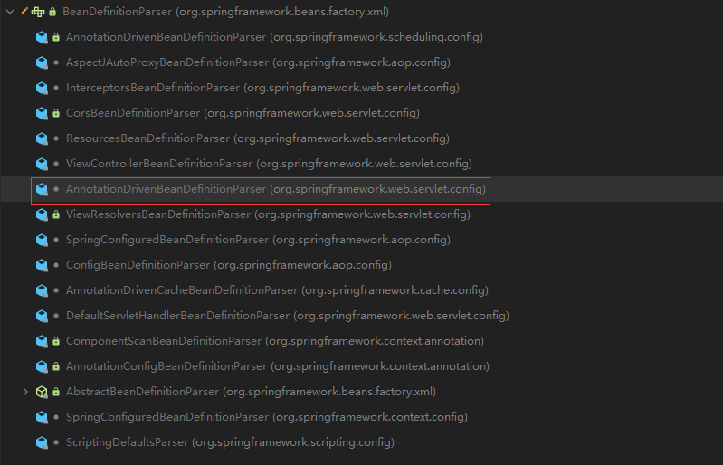

详细代码看类：
org.springframework.web.servlet.config.AnnotationDrivenBeanDefinitionParser

1、只要请求不好使就召唤mvc : annotation-driven;
1) <mvc:default-servlet-handler/> <mvc:annotation-driven/>现象:
   1)、都没配?动态资源（@RequestMapping映射的资源能访问，静态资源( .html ,.js ,.img) )
   动态能访问的原因:defaultAnnotationHandlerMapping的handlerMap中保存着每个资源的映射信息
   静态不能访问的原因：handlerMap中没有指定静态资源由那个处理器处理
   HandlerAdapter：
   动态资源通过AnnotationMethodHandlerAdapter执行目标方法
   
   2）、加上<mvc : default-servlet-handler/>，<mvc : annotation-driven/>不加    静态资源ok，动态资源完蛋
   动态资源映射的defaultAnnotationHandlerMapping没有了，而是变成一个SimpleUrlHandlerMapping将所有的请求都交给DefaultServletHttpRequestHandler
   即就是tomcat处理 tomcat中并没有配置任何servlet

   HandlerAdapter：AnnotationMethodHandlerAdapter没有了,导致动态资源不能访问
   3)、加上<mvc:default-servlet-handler/>，加上<mvc : annotation-driven/>:才都能访问
   handlerMapping: 
   simpleUrlHandlerMapping：将请求交给tomcat 处理静态资源
   requestMappingHandlerMapping：动态的资源可以访问 优先级最高 先匹配 handleMethods属性保存了每一个请求用哪个方法来处理;
   多个HandlerMapping轮流执行，不可以解析就换下一个

   HandlerAdapter：
   AnnotationMethodHandlerAdapter被换成RequestMappingHandlerAdapter
